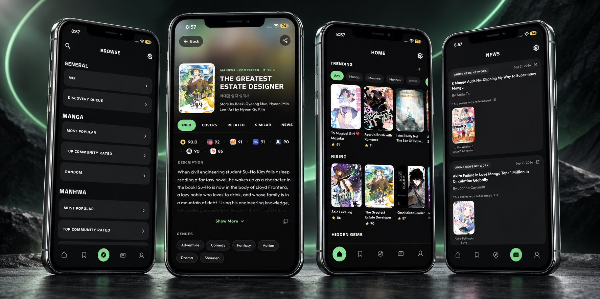

<div align="center">


# MangaBaka iOS

### An independently maintained open-source iOS client for MangaBaka

[](LICENSE)
[](#installation)
[](https://github.com/Brainer-00/MangaBaka-IOS/actions/workflows/ios-sideload.yml)
[](#installation)

<br><br>



</div>

> [!IMPORTANT]
> MangaBaka iOS is not an official MangaBaka release. It is not affiliated with or endorsed by MangaBaka, Oazzies, or the original maintainers.

## What is MangaBaka?

[MangaBaka](https://mangabaka.org/) is a database and tracking service for manga, manhwa, manhua, and light novels. It helps users discover titles, maintain a library, track reading state and progress, record ratings, and use MangaBaka account features.

MangaBaka is not a manga-reading or scanlation-hosting application. It does not provide copyrighted chapters through this client.

## About MangaBaka iOS

MangaBaka iOS is an independently maintained open-source client for the MangaBaka tracking platform, focused on iPhone and iPad use, iOS compatibility, sideloading, and a native-feeling iOS experience.

The project was developed from the open-source [MangaBaka App](https://github.com/Oazzies/MangaBaka-App) codebase and continues to credit its upstream maintainers and contributors. This repository is maintained as its own project, with iOS-oriented release automation, documentation, privacy hardening, and compatibility work while staying aligned with upstream where practical.

Repository: [Brainer-00/MangaBaka-IOS](https://github.com/Brainer-00/MangaBaka-IOS)

## Features

- Browse and search MangaBaka's title database.
- Use a MangaBaka account and library when account integration is configured.
- Track reading state, progress, and ratings.
- Import supported list and backup formats, including an optional AniList username import.
- Scan ISBN barcodes and resolve the decoded identifier through MangaBaka.
- Use responsive interfaces designed for iPhone and iPad.
- Build unsigned iOS IPA artifacts for sideloading.
- Store OAuth credentials through platform secure storage and keep diagnostic logging privacy-conscious.
- Check this project's GitHub releases for available updates.

MangaBaka iOS does not host or provide manga chapters, scanlations, or other copyrighted reading content.

## Current Status

MangaBaka iOS is in pre-release development. The project can produce an unsigned IPA suitable for development and sideload testing, but public MangaBaka account integration is still being prepared.

OAuth must not be described as fully production configured until the MangaBaka native/public application registration and physical-device validation in [the release checklist](docs/RELEASE_CHECKLIST.md) are complete. See [the OAuth architecture](docs/OAUTH.md) for the intended model.

Changes represented by the current standalone project are listed in the [changelog](CHANGELOG.md).

## Installation

Public unsigned IPA releases will be provided through this repository's [Releases](https://github.com/Brainer-00/MangaBaka-IOS/releases) page when the first release is ready.

Development IPA artifacts can be installed with a compatible sideloading tool such as Sideloadly. AltStore and SideStore integration are planned, but this repository does not currently promise an automated AltStore or SideStore installation flow.

Sideloading requirements and signing behavior depend on the tool and Apple account used. Never share Apple credentials, signing certificates, or private keys with this project.

## Account & OAuth

MangaBaka iOS uses MangaBaka's browser-based OAuth/OpenID authorization flow. The app must not collect a MangaBaka username and password in a custom form. The intended native/public client uses Authorization Code with PKCE and does not embed a client secret.

Production sign-in requires a registered MangaBaka client ID and exact redirect configuration. Client IDs are configuration values, not passwords; OAuth tokens and client secrets must never be committed. Read [docs/OAUTH.md](docs/OAUTH.md) for the architecture and remaining pre-release validation.

## Privacy

[PRIVACY.md](PRIVACY.md) explains what this application stores locally, which third-party services receive requests, how optional imports and barcode lookup work, and how diagnostic logs are handled. MangaBaka is a separate service with its own [privacy policy](https://mangabaka.org/about/privacy).

Also review the project [Terms of Use](TERMS.md) and [Attribution & Data Sources](ATTRIBUTION.md).

## Security

Please report vulnerabilities privately using the process in [SECURITY.md](SECURITY.md). Do not post tokens, credentials, sensitive logs, or vulnerability details in a public issue.

## Development / Contributing

Contributions are welcome. Start with [CONTRIBUTING.md](CONTRIBUTING.md), which covers project scope, environment setup, tests, pull requests, and secret-handling rules.

The primary quality checks are:

```sh
dart format --output=none --set-exit-if-changed lib test
flutter analyze
flutter test
```

Local iOS builds require macOS and Xcode. Repository automation can produce an unsigned IPA for sideload testing; it does not remove Apple's signing requirements on the receiving device.

## Upstream & Attribution

MangaBaka iOS is derived from [Oazzies/MangaBaka-App](https://github.com/Oazzies/MangaBaka-App), maintained by Oazzies and contributors. Upstream credit is a permanent part of this project, and compatibility with upstream changes is preserved where practical.

Detailed code, service-data, font, dependency, and branding notices are in [ATTRIBUTION.md](ATTRIBUTION.md).

## License

This repository and the upstream application code are distributed under the [Apache License 2.0](LICENSE). Individual fonts, Flutter/Dart packages, and third-party data remain under their respective licenses and terms.

## Disclaimer

MangaBaka iOS is independently maintained. It is not an official MangaBaka release and is not affiliated with or endorsed by MangaBaka or the original maintainers.

The software is provided without warranties as described by the Apache License 2.0. MangaBaka availability, account behavior, API access, and third-party services are outside this project's control.

Project documents: [Privacy](PRIVACY.md) · [Terms](TERMS.md) · [Attribution](ATTRIBUTION.md) · [Security](SECURITY.md) · [Contributing](CONTRIBUTING.md) · [Changelog](CHANGELOG.md)
