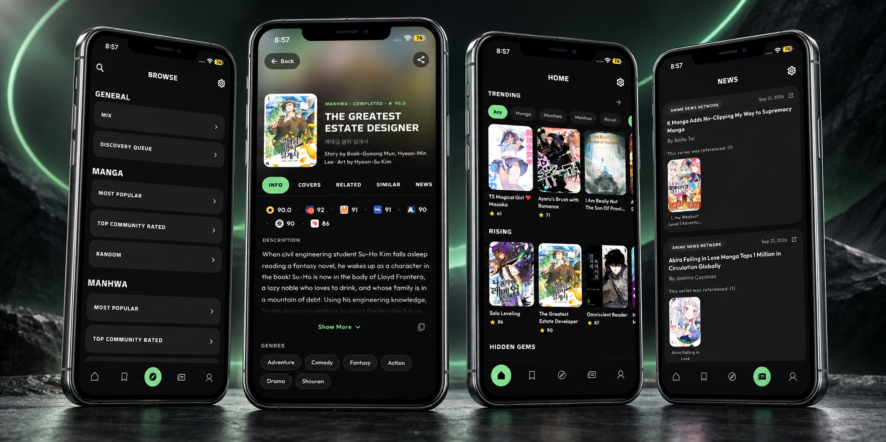

<div align="center">


# MangaBaka iOS

### An independently maintained open-source iOS client for MangaBaka

[](LICENSE)
[](#installation)
[](https://github.com/Brainer-00/MangaBaka-IOS/actions/workflows/ios-sideload.yml)
[](#installation)

<br><br>



</div>

> [!IMPORTANT]
> MangaBaka iOS is not an official MangaBaka release. It is not affiliated with or endorsed by MangaBaka, Oazzies, or the original maintainers.

## What is MangaBaka?

[MangaBaka](https://mangabaka.org/) is a database and tracking service for manga, manhwa, manhua, and light novels. It helps users discover titles, maintain a library, track reading state and progress, record ratings, and use MangaBaka account features.

MangaBaka is not a manga-reading or scanlation-hosting application. This client does not provide copyrighted chapters.

## About MangaBaka iOS

MangaBaka iOS is an independently maintained open-source client for the MangaBaka tracking platform, focused on iPhone and iPad use, sideload distribution, iOS compatibility, and a native-feeling experience.

The project was developed from the open-source [MangaBaka App](https://github.com/Oazzies/MangaBaka-App) codebase and continues to credit its upstream maintainers and contributors. This repository is maintained as its own project, with iOS-oriented release automation, documentation, privacy hardening, and compatibility work while staying aligned with upstream where practical.

Repository: [Brainer-00/MangaBaka-IOS](https://github.com/Brainer-00/MangaBaka-IOS)

## Features

- Browse and search MangaBaka's title database.
- Sign in through MangaBaka OAuth and manage account-backed library tracking.
- Track reading state, progress, and ratings.
- Import supported local list and backup formats, or import a public manga list by AniList username.
- Scan ISBN barcodes and resolve decoded identifiers through MangaBaka.
- Use responsive interfaces focused on iPhone and iPad.
- Build validated unsigned iOS IPA artifacts for sideloading.
- Store OAuth credentials in iOS Keychain-backed secure storage.
- Check this project's GitHub releases for updates, with separate stable and prerelease selection.
- Keep shareable diagnostic logs privacy-conscious through structured sanitization.

MangaBaka iOS does not host or provide manga chapters, scanlations, or other copyrighted reading content.

## Current status

The MangaBaka iOS v1.0.0 codebase has completed release-candidate validation, including the application, OAuth flow, unsigned IPA pipeline, Home launch behavior, Import List layout, and progress handling on a physical iPhone.

Changes included in v1.0.0 are listed in the [changelog](CHANGELOG.md). Release verification is tracked in the [release checklist](docs/RELEASE_CHECKLIST.md).

## Installation

Validated unsigned IPA releases and their SHA-256 checksums are distributed through this repository's [GitHub Releases](https://github.com/Brainer-00/MangaBaka-IOS/releases) page.

An unsigned IPA must be signed and installed with a compatible user-selected sideloading tool. This repository produces the IPA but does not provide automated AltStore or SideStore distribution. Apple account, certificate, provisioning, expiry, and refresh behavior depend on Apple and the selected signing tool.

Never share Apple credentials, signing certificates, or private keys with this project.

## Account and OAuth

MangaBaka iOS uses MangaBaka's system/browser-based OAuth/OpenID authorization flow. It does not collect a MangaBaka username and password in a custom form.

The app is a native/public OAuth client using Authorization Code with PKCE `S256`. It uses the exact redirect URI `io.github.brainer00.mangabaka-ios://oauthredirect`, does not embed a client secret, and stores tokens through iOS Keychain-backed secure storage. Read [docs/OAUTH.md](docs/OAUTH.md) for the implemented architecture and logout boundary.

## Privacy

[PRIVACY.md](PRIVACY.md) explains what the application stores locally, which third-party services receive requests, how imports and barcode lookup work, and how diagnostic logs are handled. MangaBaka is a separate service with its own [privacy policy](https://mangabaka.org/about/privacy).

Also review the project [Terms of Use](TERMS.md) and [Attribution & Data Sources](ATTRIBUTION.md).

## Security

Please report vulnerabilities privately using the process in [SECURITY.md](SECURITY.md). Do not post tokens, credentials, sensitive logs, or vulnerability details in a public issue.

## Development and contributing

Contributions are welcome. Start with [CONTRIBUTING.md](CONTRIBUTING.md), which covers project scope, environment setup, tests, pull requests, translations, and secret-handling rules.

The primary quality checks are:

```sh
dart format --output=none --set-exit-if-changed lib test
flutter analyze
flutter test
```

Local iOS builds require macOS and Xcode. Repository automation can produce an unsigned IPA for sideloading; it does not remove Apple's signing requirements on the receiving device.

## Upstream and attribution

MangaBaka iOS is derived from [Oazzies/MangaBaka-App](https://github.com/Oazzies/MangaBaka-App), maintained by Oazzies and contributors. Upstream credit is a permanent part of this project, and compatibility with upstream changes is preserved where practical.

Detailed code, service-data, font, dependency, branding, and sample-fixture notices are in [ATTRIBUTION.md](ATTRIBUTION.md).

## License

This repository and the upstream application code are distributed under the [Apache License 2.0](LICENSE). Individual fonts, Flutter/Dart packages, service data, title metadata, artwork, and third-party marks remain under their respective licenses and terms.

## Disclaimer

MangaBaka iOS is independently maintained. It is not an official MangaBaka release and is not affiliated with or endorsed by MangaBaka or the original maintainers.

The software is provided without warranties as described by the Apache License 2.0. MangaBaka availability, account behavior, API access, and third-party services are outside this project's control.

Project documents: [Privacy](PRIVACY.md) · [Terms](TERMS.md) · [Attribution](ATTRIBUTION.md) · [Security](SECURITY.md) · [Contributing](CONTRIBUTING.md) · [Changelog](CHANGELOG.md)
